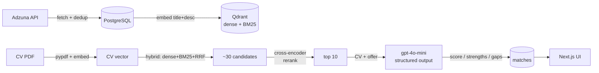

# Matchr — AI job-matching agent

Matchr reads your CV and finds the job offers that fit it best. Instead of keyword
search, it matches your CV to offers **semantically** (vector search), refines the
result with a **re-ranker**, and finally an LLM explains *why* an offer fits and *what
your CV is missing*. Also available as an **agent** — it fetches, ranks, and advises in
a multi-step loop.

> Built to go deep into AI Engineering and production systems: RAG with evaluation,
> a tool-calling agent, observability, background processing — tested, measured, and
> hardened for production.

## How it works — a three-stage funnel

Matching is a funnel: each stage is narrower and more expensive, so the costly model
only ever sees the best candidates.



1. **Retrieval (cheap, broad):** hybrid search — dense (`text-embedding-3-small`,
   semantics) + BM25 (exact technologies) + RRF fusion in Qdrant.
2. **Re-ranking (medium, precise):** a multilingual cross-encoder narrows 30 → 10.
3. **LLM (expensive, nuanced):** `gpt-4o-mini` with structured output — a 0–100 score,
   strengths, and gaps (grounded in the offer, not hallucinated).

## How I measure AI quality (LLMOps)

Every change to retrieval/prompts is judged by **data**, not by eyeballing:

- **Golden set** — CVs with labeled relevant offers (ground truth).
- **Retrieval metrics** — `recall@k` (did we find the relevant ones) and `MRR` (are they
  ranked high). These showed hybrid lifted MRR from 0.25 → 0.50, and re-ranking to 0.667.
- **Faithfulness (LLM-as-judge)** — a second, stronger model checks that explanations are
  grounded in the CV/offer (anti-hallucination). I **calibrate** the metric by hand
  against ground truth, because the judge itself can be wrong.
- Metrics are unit-tested and run in CI; the full eval is a periodic tool.

This "change → measure → decide" loop caught, for example, that an English re-ranker
degraded quality 4× on Polish data — swapped for a multilingual one after measuring.

## Agent

Agent mode: the LLM decides which tools to use (`fetch_jobs`, `rank_jobs`) and in what
order, in an observe→decide→act loop. Resilient (tool errors become observations, step
limit), secure (`user_id` from the token, never from the model), with response streaming
and per-user conversation history.

## Tech stack

| Layer | Tech |
|---|---|
| Frontend | Next.js (React, TypeScript), SSE streaming |
| Backend | FastAPI (Python) |
| Relational data | PostgreSQL (jobs, cv, matches, users, agent_messages) |
| Vector search | Qdrant (dense 1536 + sparse BM25, RRF) |
| Re-ranking / sparse | fastembed (jina multilingual, BM25) |
| Cache / queue / rate limit | Redis + RQ (background jobs) |
| AI | OpenAI (embeddings + chat, structured outputs) |
| Job source | Adzuna API |
| Observability | JSON logs + request-id, Prometheus metrics |
| Orchestration | Docker Compose (backend, worker, postgres, qdrant, redis) |

## Production engineering

- **Tests** (pytest) + **CI/CD** (GitHub Actions: ruff lint → tests → build).
- **Observability:** structured logging with correlation-id, metrics (latency, tokens,
  cache hit-rate, LLM calls) at `/metrics`.
- **Background jobs** (RQ): indexing and ranking don't block the request — idempotent,
  with retry and DLQ; the worker warms models at startup.
- **Security:** JWT + bcrypt, per-`user_id` data isolation, guardrails (input validation,
  delimiting, prompt-injection defense).
- **Profiling:** latency budget measured per stage (rerank identified as the bottleneck →
  moved to the background).
## Running locally

Requirements: Docker, Node.js, API keys for OpenAI and Adzuna (both have free tiers).

```bash
# .env at project root (POSTGRES_*, OPENAI_API_KEY, ADZUNA_*, JWT_SECRET)
docker compose up --build          # backend + worker + postgres + qdrant + redis
cd frontend && npm install && npm run dev
```

API: http://localhost:8000/docs · Front: http://localhost:3000 · Metrics: /metrics

## Notes

Personal, non-commercial project. Job data from Adzuna's official API (free tier). Keys
and CVs are kept local (git-ignored), never committed. For a production version with real
CVs: a local model, or a DPA + data minimization (GDPR).