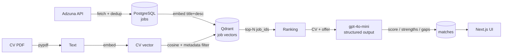

# Matchr — AI job-matching agent

Matchr reads your CV and finds the job offers that fit it best. Instead of keyword
search, it matches your CV against real offers **semantically** (vector similarity),
then uses an LLM to explain *why* each offer fits and *what your CV is missing* for it.

> Personal project built to explore AI engineering + systems architecture:
> RAG-style retrieval, vector search, LLM structured outputs, and a clean,
> layered backend behind a Next.js frontend — all running in Docker.

<!-- TODO: wstaw zrzut ekranu lub GIF działania aplikacji -->
<!--  -->

## How it works

Matching happens in **two complementary layers**:

1. **Vector retrieval (fast, broad).** The CV and every job offer are turned into
   embeddings (`text-embedding-3-small`). Qdrant finds the offers whose vectors are
   closest to the CV by cosine similarity — this catches semantic fit even when the
   exact keywords differ.
2. **LLM judgement (slow, nuanced).** For the top matches, an LLM (`gpt-4o-mini`)
   compares CV vs offer and returns a **structured** verdict: a 0–100 match score,
   a list of strengths, and a list of gaps in the CV. This captures nuances that raw
   similarity misses (seniority, specific required tech), and turns a ranking into
   actionable feedback.



## Tech stack

| Layer | Tech |
|---|---|
| Frontend | Next.js (React, TypeScript) |
| Backend | FastAPI (Python) |
| Relational data | PostgreSQL (jobs, cv, matches) |
| Vector search | Qdrant (1536-dim, cosine) |
| Cache / rate limit | Redis |
| AI | OpenAI (embeddings + chat with structured outputs) |
| Job source | Adzuna official API |
| Orchestration | Docker Compose |

## Running locally

**Prerequisites:** Docker, Node.js, and API keys for [OpenAI](https://platform.openai.com)
and [Adzuna](https://developer.adzuna.com) (both have free tiers).

1. Create `.env` in the project root (see `.env.example`):

   ```env
   POSTGRES_USER=matchr
   POSTGRES_PASSWORD=change_me
   POSTGRES_DB=matchr
   OPENAI_API_KEY=sk-...
   ADZUNA_APP_ID=...
   ADZUNA_APP_KEY=...
   ```

2. Start the backend stack (FastAPI + PostgreSQL + Qdrant + Redis):

   ```bash
   docker compose up --build
   ```

   API docs: http://localhost:8000/docs · Qdrant dashboard: http://localhost:6333/dashboard

3. Start the frontend:

   ```bash
   cd frontend
   npm install
   npm run dev
   ```

   App: http://localhost:3000

4. In the UI: upload your CV (PDF), type a role (e.g. `frontend developer`), hit
   **Analyze**, and read the ranked matches with per-offer explanations.

## Architecture notes

The backend follows a **layered / clean architecture**:

```
backend/app/
├── domain/        # entities & read models (Job, JobIndexItem) — no framework deps
├── sources/       # input adapters (JobSource interface + AdzunaSource)
├── repository/    # data access (PostgreSQL)
├── usecases/      # orchestration (fetch, rank, explain)
├── ai/            # embeddings + LLM explanations
├── api/           # FastAPI controllers (thin HTTP layer)
├── vectordb.py    # Qdrant client
├── db.py          # PostgreSQL connection
└── cache.py       # Redis client
```

Each layer depends only on the one beneath it; the domain knows nothing about the
outside world. The frontend mirrors this: a typed API layer (`lib/api.ts`) and
presentational components composed by a thin page.

**Design highlights:**
- **Deduplication** at two levels — `ON CONFLICT (external_id)` in Postgres and
  point-id upsert in Qdrant.
- **Search-scoped ranking** via Qdrant **metadata filtering** (`search_query` in the
  payload), so switching the searched role changes the candidate pool without
  deleting history.
- **Redis caching** of fetched offers and (expensive) LLM explanations, keyed by a
  hash of the inputs, plus rate limiting on the external API.
- **Structured LLM outputs** (Pydantic) — no fragile string parsing.

## Possible extensions

- Deduplicate near-duplicate offers (same role reposted under different IDs) by
  `title + company`.
- Scheduled daily runs that fetch new offers and email the best new matches.
- Support more job sources behind the existing `JobSource` interface.
- Generate a tailored cover letter per offer; track applications.

## Notes

Built for personal, non-commercial use. Job data comes from Adzuna's official API,
used within its free tier and terms. API keys and uploaded CVs are kept local
(git-ignored) and never committed.
